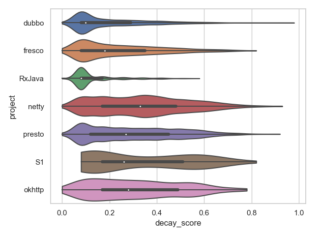

[Back](https://saner-decay-factors.github.io/)

# Additional Analysis - Score Distribution

After executing the steps described in the paper we were able to observe how the decay score proposed by this work behaved in the seven software systems of our study. 

The figure above provides a violin plot that illustrates the distribution of decay scores per system. As we can observe, there is a significant difference between how slightly- and largely-decayed classes behave in terms of score. The group of former classes (i.e., in the lower quartile of decay score, presented in the graph) was densely grouped, which means they share similarities in the amount of IQAs that have deteriorated. On the other hand, the latter classes were more sparse, showing that the IQAs decayed in a more varied degree.

The violin plot used in the Figure displays data using a simplified box plot, with the thin lines in the edges of the plot representing the lower and upper quartiles, and the thick line representing the middle quartiles, separated by a white dot which is the median. They also visually display the distribution (or density) of elements by relying on the thickness of the colored shape that surrounds the box plot.

We can also observe that all projects behave quite differently, and only few projects with similar behavior, such as dubbo vs. RxJava, netty vs. okhttp, and fresco vs. presto. This observation confirms the diversity in behavior of the selected projects.